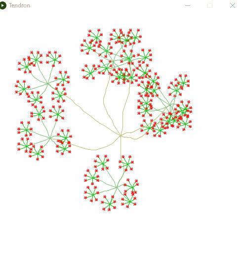
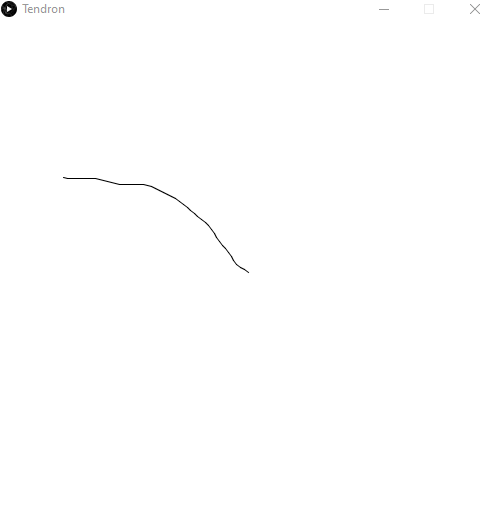

Tendron
==================

In this lab, you will use recursion to generate a tendron. A tendron has a cluster of 7 tendrils. At the end of each tendril is a cluster of 7 smaller tendrils. This pattern of clusters of tendrils repeats until the tendrils reach a minimum tendril length. You can think of this as a slightly more complex [Fractal tree](https://github.com/APCSLowell/FractalTree#fractal-tree). Instead of 2 branches in a v shape, there are 7 tendrils that radiate in all directions. Instead of straight branches, the tendrils wiggle randomly left and right as they radiate outward.

Your code will draw the Tendron recursively, modifying the structure as the elements get smaller, going through smaller tendrils and clusters. Every time the `draw()` function runs, it generates a new and different Tendron since growth occurs randomly.   

The main program, `Tendron.pde`, sets up the `size()` and `background()`. Then when `draw()` is called, it creates a new `Cluster` by calling the constructor of the Cluster class, telling it to draw a cluster of tendrils starting at the midpoint of the screen with each tendril using 50 short segments.      

A cluster is a group of seven tendrils. Each tendril is made of a series of short line segments, and as each segment is drawn, it may turn a bit left or right, giving a more life-like appearance.   

At the end of each tendril, a new cluster is created. The new cluster will have fewer line segments, therefore each tendril will be shorter than before. Recursively, these tendrils will again spawn clusters until a minimum tendril length is reached. Here is the final result:

    

When drawn, the tendrils together look very plant-like for such a simple algorithm. The effect is enhanced by using the tendril length to determine the line color used when drawing.   

Suggested steps to completing this assignment:
----------------------------------------------
1. Fork and clone down this repository   

2. Write code in the `Cluster` class constructor which makes one `new Tendril()`. Then show the tendril with a random angle between 0 and 2π.

3. Complete the `Tendril` class `show()` function which does the actual drawing. The `show` method draws the tendril using only the two Processing functions [`line`](https://processing.org/reference/line_.html) and [`stroke`](https://processing.org/reference/stroke_.html). In drawing the tendril, we will wiggle the direction with random walk for a life-like appearance. Here's one way to randomly wiggle the line: 

    * repeat `len` times
      * Change `theta` by a random decimal from -0.2 to 0.2
      * declare `endX` and initialize it to `x` plus the cosine of `theta` times 4
      * declare `endY` and initialize it to `y` plus the sine of `theta` times 4
      * draw a line from (x,y) to (endX,endY)
      * Set `x` to `endX`
      * Set `y` to `endY`

4. Run your program. You should see one random tendril every time you click the screen
    
5. Now go back to the `Cluster` constructor and modify it to make seven Tendrils
6. In the Tendril `show()` add code that recursively creates a new `Cluster` at the end of each Tendril if `len` is greater than 3 or some other value
7. Add code at the beginning of the Tendril `show()` function to determine the 'stroke()` used when drawing.

Extensions
----------------------
The instructions above are only a suggestion. Have fun and be creative. Your Tendron doesn't have to look like any other.

Samples of Student Work
-----------------------
None yet!   

*Note: this assignment was adapted from [Roger Frank's APCS assignment](https://web.archive.org/web/20100118105220/http://rfrank.net:80/cslabs-final/1640-tendron/1640.html)*
